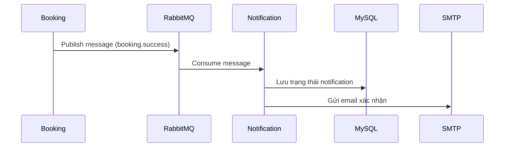

# 📊 Phân tích và thiết kế module: ĐẶT LỊCH HẸN KHÁM BỆNH

## 1. 🎯 Mô Tả Vấn Đề

**Bài toán:**
Xây dựng module đặt lịch hẹn khám bệnh cho khách hàng

**Người dùng:**

- Khách hàng

**Mục tiêu chính:**
- Cho phép khách hàng đặt lịch hẹn khám trực tuyến theo chuyên khoa, ngày khám, ca khám, bác sĩ
- Hiển thị lịch trống của các bác sĩ theo chuyên khoa
- Gửi email xác nhận khi đặt lịch thành công

**Dữ liệu xử lý:**
- Thông tin khách hàng (Customer): họ tên, email, số điện thoại, tên đăng nhập, mật khẩu
- Thông tin khoa khám (Category): tên khoa khám, chi phí khám
- Thông tin bác sĩ (Doctor): tên bác sĩ, khoa làm việc
- Thông tin lịch làm việc (Schedule): ngày, ca, số lượng slot, trạng thái khả dụng
- Thông tin lịch hẹn (Booking): khách hàng, bác sĩ, khoa khám, ngày khám, ca khám, trạng thái
- Thông báo (Notification): trạng thái, thời gian gửi, loại thông báo, tham chiếu đến lịch hẹn

---

## 2. 🧩 Các Microservice
Danh sách các microservices trong hệ thống và nhiệm vụ của từng service.

| Service Name           | Responsibility                                                                                   | Tech Stack         |
|------------------------|--------------------------------------------------------------------------------------------------|--------------------|
| gateway                | Định tuyến các request tới các microservice khác trong hệ thống                                  | Flask, Nginx       |
| service-booking &nbsp;&nbsp;&nbsp;&nbsp;&nbsp;&nbsp;&nbsp;&nbsp;&nbsp;&nbsp;        | Xử lý quy trình đặt lịch (booking) và điều phối Saga Pattern	 | Python Flask, MongoDB &nbsp;&nbsp;&nbsp;&nbsp;&nbsp;&nbsp;&nbsp;&nbsp;&nbsp;&nbsp; |
| service-doctor         | Quản lý thông tin bác sĩ và lịch làm việc (doctor + schedule)     | Python Flask, MongoDB |
| service-customer        | Quản lý thông tin khách hàng. (Customer)                                                         | Python Flask, MongoDB |
| service-category       | Quản lý danh mục khoa khám, bao gồm các thông tin về khoa khám và chi phí. (Category)           | Python Flask, MongoDB |
| service-notification   | Gửi thông báo xác nhận lịch hẹn qua email cho khách hàng. (Notification)                        | Python Flask, MySQL |
| rabbitmq               | Message broker dùng để truyền tin giữa các service-booking và service-notification.             | RabbitMQ           |
| mysql                  | Cơ sở dữ liệu lưu trữ thông tin thông báo.                                                       | MySQL              |

---

## 3. 🔄 Giao Tiếp Giữa Các Services

- Gateway ⇄ Service Doctor (REST API): Chuyển yêu cầu và nhận dữ liệu bác sĩ, lịch làm việc.

- Gateway ⇄ Service Customer (REST API): Quản lý thông tin khách hàng.

- Gateway ⇄ Service Category (REST API): Lấy danh mục khoa khám, dịch vụ.

- Gateway ⇄ Service Booking (REST API): Xử lý yêu cầu đặt lịch.

- Service Booking ⇄ Service Notification (Message Queue – RabbitMQ)  
  - Service Booking publish sự kiện đặt lịch thành công lên RabbitMQ.  
  - Service Notification subscribe các sự kiện từ RabbitMQ để xử lý gửi email xác nhận.

- Service Notification ⇄ MySQL (Database)  
  - Service Notification lưu trữ dữ liệu thông báo qua MySQL.

  

---

## 4. 🗂️ Thiết Kế Dữ Liệu
Trong module đặt lịch khám bệnh, mỗi service hoạt động độc lập và sở hữu cơ sở dữ liệu riêng biệt. Mục tiêu chính là đảm bảo tính tách biệt dữ liệu, khả năng mở rộng và bảo trì dễ dàng, đúng theo nguyên tắc "Database per Service" trong kiến trúc microservices.

Mỗi service chỉ quản lý dữ liệu của riêng nó, và các service không được phép truy cập trực tiếp vào cơ sở dữ liệu của nhau. Thay vào đó, mọi giao tiếp đều thông qua API hoặc thông điệp bất đồng bộ.

### Service Customer (MongoDB)
**Table: customers**
| Column   | Type         | Mô tả                       |   
|----------|--------------|-----------------------------|
| id       | ObjectId     | ID khách hàng (Khóa chính)  |
| fullname | String       | Họ và tên khách hàng        |
| phone    | String       | Số điện thoại               |
| email    | String       | Email                       |
| username | String       | Tên đăng nhập               |
| password | String       | Mật khẩu                    |

### Service Category (MongoDB)
**Table: categories**
| Column | Type          | Mô tả                        |
|--------|---------------|------------------------------|
| id     | ObjectId   | ID khoa khám (Khóa chính)  |
| name   | String  | Tên khoa khám |
| price  | Integer | Chi phí khám |

### Service Doctor (MongoDB)
**Table: doctors**
| Column      | Type         | Mô tả                    |
|-------------|--------------|--------------------------|
| id          | ObjectId     | ID bác sĩ (Khóa chính)   |
| name        | String       | Tên bác sĩ               |
| category_id | String       | ID khoa khám           |

**Table: schedules**

| Column       | Type         | Mô tả                          |
|--------------|--------------|--------------------------------|
| id           | ObjectId     | ID lịch làm việc (Khóa chính)  |
| schedule_id  | String       | ID lịch khám                      |
| doctor_id    | String       | ID bác sĩ                      |
| date         | Date         | Ngày khám bệnh                 |
| time         | String       | Ca khám bệnh                   |
| slot         | Integer      | Số slot còn trống              |

### Service Booking (MongoDB)
**Table: bookings**
| Column      | Type         | Mô tả                    |            
|-------------|--------------|--------------------------|
| id          | ObjectId     | ID lịch hẹn (Khóa chính) |
| customer_id | String       | ID khách hàng            |
| doctor_id   | String       | ID bác sĩ                |
| date        | String       | Ngày khám bệnh           |
| time        | String       | Ca khám bệnh             |
| status      | String       | Trạng thái đặt lịch (pending, confirmed, cancelled)    |

### Service Notification (MySQL)
**Table: notifications**
| Column     | Type         | Mô tả                                          |
|------------|--------------|------------------------------------------------|
| id         | VARCHAR(36)  | Khóa chính                                     |
| booking_id | VARCHAR(24)  | ID lịch hẹn                                    |
| sent_at    | DATETIME     | Thời gian gửi thông báo                        |
| status     | VARCHAR(50)  | Trạng thái thông báo (pending, sent)   |
| type       | VARCHAR(50)  | Loại thông báo (confirmation)                  |
| created_at | DATETIME     | Thời điểm tạo bản ghi                          |

### ERD – Sơ đồ các thực thể và mối liên hệ
Sơ đồ dưới đây mô tả các entities chính và mối liên kết logic giữa chúng. Các liên kết chỉ được biểu diễn dưới dạng ID tham chiếu, không ràng buộc bằng khóa ngoại.

---

## 5. 📦 Kế Hoạch Triển Khai

### 🧱 Kiến trúc triển khai
- Sử dụng [`docker-compose.yml`](../docker-compose.yml) để quản lý và khởi chạy toàn bộ các service.
- Mỗi service có Dockerfile riêng để đóng gói.
- Cấu hình môi trường đặt tại [`.env`](../env.example.yml)
- Các service độc lập về logic và cơ sở dữ liệu (MySQL / MongoDB).
- RabbitMQ dùng làm hệ thống message broker để truyền thông bất đồng bộ giữa Service Booking và Service Notification.

### ⚙️ Các thành phần chính

| 🧩 Service | Mô tả | File cấu hình |
|-----------|-------|----------------|
| **service-customer** | Quản lý khách hàng | [`services/service-customer/Dockerfile`](../services/service-customer/Dockerfile) |
| **service-category** | Quản lý danh mục khoa khám | [`services/service-category/Dockerfile`](../services/service-category/Dockerfile) |
| **service-doctor** | Quản lý thông tin bác sĩ và lịch làm việc | [`services/service-doctor/Dockerfile`](../services/service-doctor/Dockerfile) |
| **service-booking** | Đặt lịch hẹn, gửi sự kiện qua RabbitMQ | [`services/service-booking/Dockerfile`](../services/service-booking/Dockerfile) |
| **service-notification** | Lắng nghe queue và gửi email (SMTP) | [`services/service-notification/Dockerfile`](../services/service-notification/Dockerfile) |
| **gateway**            | Định tuyến các request từ client đến các service nội bộ | [`gateway/Dockerfile`](../gateway/Dockerfile)             |
| **rabbitmq** | Hàng đợi tin nhắn trung gian | [`docker-compose.yml`](../docker-compose.yml) |
| **mysql** | Cơ sở dữ liệu cho Notification Service | [`docker-compose.yml`](../docker-compose.yml) |

---

## 6. 🎨 Sơ Đồ Kiến Trúc
Sơ đồ dưới đây mô tả kiến trúc tổng thể của các microservices, thể hiện cách các service giao tiếp với nhau thông qua REST API và Message Broker. Gateway đóng vai trò trung tâm tiếp nhận yêu cầu từ client và định tuyến đến các service tương ứng. Các luồng xử lý nền như gửi thông báo được tách riêng để đảm bảo hiệu năng và khả năng mở rộng.

---

## ✅ TỔNG KẾT
Module đặt lịch khám bệnh được xây dựng theo kiến trúc Microservices, giúp phân tách rõ ràng từng chức năng như: quản lý khách hàng, bác sĩ, chuyên khoa, lịch hẹn và thông báo. Mỗi service đảm nhiệm một domain riêng biệt và có thể phát triển, triển khai, mở rộng hoặc bảo trì một cách độc lập.

Các service giao tiếp với nhau chủ yếu qua REST API thông qua Gateway, trong khi các luồng xử lý nền như gửi email xác nhận sử dụng RabbitMQ để truyền thông bất đồng bộ.

Hệ thống được đóng gói bằng Docker và quản lý bằng Docker Compose, giúp dễ dàng triển khai đồng bộ các thành phần, tái tạo môi trường nhanh chóng và hỗ trợ quy trình DevOps hiệu quả.

Tổng thể, mô hình đảm bảo tính mở rộng, ổn định và sẵn sàng để tích hợp vào các hệ thống lớn hơn hoặc phục vụ nhu cầu thực tế với lưu lượng người dùng cao.
